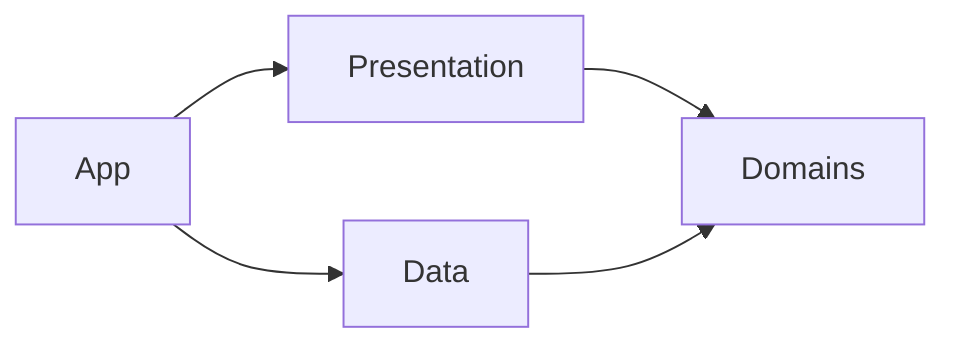

# System Overview

## 한글 요약

- `BucksCopy`는 SwiftUI 네이티브 macOS 앱으로 시작합니다.
- 초기 거래소는 Bitget, 상품 범위는 USDT-M Futures, 실행 모드는 명시 동의 기반 live auto-trading입니다.
- Bitget API product line은 v1에서 `productType=USDT-FUTURES` 단일값으로 고정합니다.
- Dashboard v1 심볼 catalog와 Watchlist는 BTCUSDT/ETHUSDT만 앱 상태에 보관하고 노출합니다.
- 레이어는 `App / Presentation / Domains / Data` 네 축으로 단순하게 둡니다.
- Bitget candle 조회 한계를 보완하기 위해 Watchlist 시장 데이터는 로컬 DB에 누적 저장합니다.
- Dashboard v1은 Connect-only API credential 입력, 연결 후 계정 요약, BTC/ETH Watchlist, interactive Bitget-backed SwiftUI Canvas candle chart, 백그라운드 백테스트, 실계정 포지션, Live bot 로그를 한 화면에 둡니다.
- 실거래 주문은 credential 연결, UI 실거래 동의, Start Live, risk policy 통과, portfolio arbitration 이후에만 실행됩니다.

## 구조 원칙

1. UI, 도메인 규칙, 거래소 연동, 저장소, 실행 엔진을 분리합니다.
2. API credential은 Keychain-facing Data 코드만 소유합니다.
3. Bitget REST/WS 응답은 Data 경계에서 DTO로 받고 Domain 모델로 변환합니다.
4. Strategy는 주문 API를 직접 부르지 않고 live execution gateway contract만 사용합니다.
5. Candle 생성은 deterministic하게 테스트 가능한 Domain/Data 경계로 둡니다.
6. Watchlist에 없는 심볼은 WebSocket 구독, strategy 실행, live order 생성 대상이 아닙니다.
7. Backtest/validation strategy는 closed candle만 소비하고, Live monitor는 명시적으로 모델링된 현재 forming candle도 후보 평가에 포함할 수 있습니다.

## 레이어별 책임

| 레이어 | 넣는 것 | 넣지 않는 것 |
| --- | --- | --- |
| App | macOS entry, window/menu, composition root, environment 선택 | feature 내부 상태, Bitget DTO, strategy rule |
| Presentation | 로그인/API 인증 UI, Watchlist 선택 UI, bot status UI, strategy setting UI, reusable SwiftUI component | Keychain 직접 접근, URLSession/WebSocket 직접 접근, strategy rule |
| Domains | futures symbol, contract spec, watchlist, candle/order/portfolio/strategy/risk contract, use case, business rule | Bitget endpoint, SwiftUI, Keychain, URLSession, SQLite |
| Data | Bitget router, DTO, repository 구현, HTTP/WebSocket adapter, Keychain credential store, local market history store, clock/logging/error adapter | SwiftUI 화면, strategy policy, raw credential 로그 |

## 목표 의존 방향

## Bitget Integration Defaults

- REST base domain: `https://api.bitget.com`.
- WebSocket public domain: `wss://ws.bitget.com/v2/ws/public`.
- WebSocket private domain: `wss://ws.bitget.com/v2/ws/private`.
- v1 API family: Classic Futures v2 mix API.
- v1 product type: `USDT-FUTURES`.
- v1 margin coin: `USDT`.
- Private REST requests require signed headers.
- WebSocket connections must implement ping/pong and reconnect policy.
- WebSocket subscriptions are scoped to Watchlist symbols only.
- Keep one WebSocket connection at or below 50 subscribed channels by default.
- Candle channels and REST candle history are treated as exchange input; internal candle aggregation remains testable without network.
- Connect stores credentials in Keychain, validates private API access, and saved credentials auto-connect on the next launch.

## Bitget API / Socket Scope

| Scope | Endpoint / Channel | Purpose |
| --- | --- | --- |
| Public REST | `GET /api/v2/mix/market/contracts` | Load USDT-M Futures contract config and Watchlist candidates |
| Public REST | `GET /api/v2/mix/market/candles` | Backfill historical candles |
| Public REST | `GET /api/v2/mix/market/history-candles` | Backfill older finished candles when normal candle range is insufficient |
| Public WS | `ticker` | Latest price, bid/ask, funding/state display |
| Public WS | `trade` | Trade stream for higher-fidelity market input |
| Public WS | `candle1m` | Default live candle input for internal aggregation |
| Private REST | `GET /api/v2/mix/account/accounts` | Credential test and account snapshot |
| Private REST | `GET /api/v2/mix/position/all-position` | Position snapshot and replacement scoring input |
| Private REST | `POST /api/v2/mix/account/set-leverage` | Set symbol leverage before live entry |
| Private REST | `POST /api/v2/mix/order/place-order` | Live market entry after explicit UI gate and risk approval |
| Private REST | `GET /api/v2/mix/order/detail` | Confirm live market entry fill receipt before position verification |
| Private REST | `POST /api/v2/mix/order/place-tpsl-order` | Exchange-side TP1/TP2/SL protection order adapter |
| Private REST | `POST /api/v2/mix/order/close-positions` | Fail-closed close and replacement close path |
| Private WS | `orders` | Order status tracking structure |

## Dashboard UX Defaults

- Credential entry has one primary `Connect` action. It saves `APIKey`, `SecretKey`, and `Passphrase` through Keychain-facing Data code and immediately validates Bitget private REST access.
- When a saved credential exists at app launch, the dashboard attempts auto-connect before showing account-dependent data.
- After connection, the top-left credential form is replaced by a user/account summary showing equity, available balance, unrealized PnL, and read-only position count.
- The left column is scrollable because strategy, bot, and backtest controls can exceed the compact macOS window height.
- BTCUSDT/ETHUSDT are the only Dashboard v1 symbols, so the Watchlist panel does not include symbol search.
- The candle chart uses one price pane. Volume is not drawn as a separate chart until the UI explicitly labels and designs it.
- The chart includes a right-side price axis, latest-price line, zoom controls, reset, horizontal drag pan, and vertical drag pan.
- Chart zoom uses continuous candle spacing instead of a fixed visible-count jump. As spacing changes, candle width and visible candle count change together.
- The default viewport should focus on recent candles instead of scaling every locally stored candle into one compressed view.
- The bottom dashboard band is a cumulative Live automation ledger, not a per-start reset view. It shows first saved seed equity, current equity, estimated net profit excluding open unrealized PnL, cumulative active duration, entry/close log counts, open position count, risk event count, and close-outcome win rate when close logs carry PnL metadata. Replacement close outcomes are based on the position snapshot's pre-close PnL until a full order-history realized-PnL integration exists.

## Watchlist Rules

- Load Dashboard v1 symbols with `GET /api/v2/mix/market/contracts?productType=USDT-FUTURES&symbol=BTCUSDT` and the same request for `ETHUSDT`.
- A symbol can be selected only when `symbolStatus=normal` and `supportMarginCoins` contains `USDT`.
- Dashboard v1 keeps only BTCUSDT and ETHUSDT from the tradable contract response.
- Watchlist symbols drive WebSocket subscription, strategy execution, and live order eligibility.
- Watchlist overflow must either split WebSocket connections or fail validation before subscribe.
- The first implementation should prefer validation failure over silent partial subscription.

## Local Market History Strategy

- Store market history locally for Watchlist symbols because Bitget candle APIs cannot guarantee unlimited lookback from the current moment.
- v1 default storage is a SQLite-backed Data adapter. Do not store API key, secret, passphrase, or raw private account/order payloads in this DB.
- Persist normalized 1m closed exchange candles and derived closed candles for `15m`, `1H`, `4H`, `12H`, and `1D`.
- Use `(productType, symbol, granularity, openTime)` as the natural unique key so REST backfill and WebSocket updates are idempotent.
- Current implementation: on app start, load local candles, then seed every Dashboard Watchlist symbol across `15m`, `1H`, `4H`, `12H`, and `1D` through Bitget REST candle backfill unless that symbol/timeframe already has a complete local history cursor. The selected chart keeps a matching public WebSocket candle subscription for live updates.
- Selected symbol/timeframe changes reload the local chart view and switch only the matching live WebSocket candle subscription; they do not restart historical backfill for that tab.
- Target gap-fill implementation: load the last local closed candle per Watchlist symbol, request only the missing gap from Bitget, upsert the result, then resume WebSocket streaming.
- If no local history exists, seed from the maximum officially queryable REST range, then continue accumulating locally from that point forward.
- Keep in-progress candles either in memory or stored with an explicit non-closed state. Backtest/validation ignores non-closed candles; Live monitor may include the current forming candle when `openTime <= now < closeTime`.
- Public WebSocket candle pushes are stored with an explicit non-closed state until a later interval or REST refresh confirms closure.
- Live execution keeps minimal local audit metadata for strategy review; raw private account/order payloads and raw order identifiers are not persisted in logs.

## Candle API Limits To Design Around

- `GET /api/v2/mix/market/candles` is limited to 20 requests per second per IP, returns 100 rows by default, and allows up to 1000 rows per request.
- Normal candle query history varies by granularity: `1m/3m/5m` up to one month, `15m` up to 52 days, `30m` up to 62 days, `1H` up to 83 days, `2H` up to 120 days, `4H` up to 240 days, and `6H` up to 360 days.
- `startTime`/`endTime` requests have a maximum query range of 90 days.
- `GET /api/v2/mix/market/history-candles` is also limited to 20 requests per second per IP and returns a maximum of 200 finished candles per request.

## Planned Domain Types

| Type | Role |
| --- | --- |
| `FuturesSymbol` | Bitget USDT-M Futures symbol identity |
| `ContractSpec` | precision, min trade, multiplier, margin support, symbol status |
| `APIKeyCredential` | APIKey, SecretKey, Passphrase bundle stored only through Keychain-facing Data adapter |
| `CredentialStatus` | disconnected/saved/validating/connected/failed UI state |
| `DashboardState` | combined Presentation state for credential, Watchlist, candles, positions, strategy, logs |
| `Watchlist` | user-selected tradable symbol set |
| `Candle` | OHLCV data for 15m/1H/4H/12H/1D |
| `MarketHistoryCursor` | last persisted closed candle per symbol/granularity |
| `PositionSnapshot` | read-only Bitget current position projection |
| `StrategyDefinition` | built-in strategy registry item |
| `StrategyConfig` | selected strategy and parameter values |
| `StrategyRunState` | stopped or running Live state |
| `StrategySignal` | strategy output before order intent |
| `LiveOrderRequest` | desired live exchange order action after strategy/risk approval |
| `LiveOrderReceipt` | exchange order submission/fill confirmation record |
| `RiskDecision` | allow/block decision with reason |
| `TradeEventLog` | persistent bot/signal/live/risk/position event log with redacted order identifiers |

References:

- [Bitget API Domain](https://www.bitget.com/api-doc/common/domain)
- [Bitget REST API / Signature](https://www.bitget.com/api-doc/classic/quickStart/intro)
- [Bitget WebSocket API](https://www.bitget.com/api-doc/classic/quickStart/websocket-intro)
- [Bitget Futures Contract Config](https://www.bitget.com/api-doc/classic/contract/market/Get-All-Symbols-Contracts)
- [Bitget Futures Candlestick Channel](https://www.bitget.com/api-doc/classic/contract/websocket/public/Candlesticks-Channel)
- [Bitget Futures Candle Data](https://www.bitget.com/api-doc/classic/contract/market/Get-Candle-Data)
- [Bitget Futures Historical Candle Data](https://www.bitget.com/api-doc/contract/market/Get-History-Candle-Data)
- [Bitget Futures Place Order](https://www.bitget.com/api-doc/contract/trade/Place-Order)
- [Bitget Futures Stop-profit and Stop-loss Plan Orders](https://www.bitget.com/api-doc/contract/plan/Place-Tpsl-Order)
- [Bitget Futures Order Channel](https://www.bitget.com/api-doc/classic/contract/websocket/private/Order-Channel)

## Trading Defaults

- Supported planning timeframes: `15m`, `1H`, `4H`, `12H`, `1D`.
- Backtest strategy logic consumes closed candle data. Live monitoring explicitly models the current forming candle for earlier entry decisions.
- Built-in strategies must emit `entryPrice`, `stopLoss`, and `takeProfit` together when they produce a signal.
- Built-in strategy inputs are limited to local OHLCV candles, so implemented indicators are computed internally from close/high/low/volume rather than requested from Bitget. Backtest input remains closed-only; Live input may include the latest forming candle.
- Built-in strategy set: X, VWMA100 touch trend, Donchian channel breakout, and Time-Series momentum.
- Strategy signals use the main strategy output and risk policy as the default trading path. Auxiliary indicator Gate data has been removed from the active decision path after validation showed weak path stability.
- Live monitoring is independent from the chart-selected timeframe. When Live is running, it evaluates every Watchlist symbol across `15m`, `1H`, `4H`, `12H`, and `1D`, using the recommended strategy list for each timeframe.
- The Dashboard Live monitor loop evaluates candidates every 3 seconds by default until the engine is moved to a fully WebSocket-event-driven trigger.
- Live monitoring stores a `(symbol, timeframe, strategy, candle open time)` key to avoid generating duplicate live entries from the same candle after a signal is accepted.
- When Live starts, the monitor first primes the current latest completed candle keys for every Watchlist route. Those already-completed candles cannot create immediate live entries; the current forming candle remains eligible if it later emits a signal.
- Live monitoring collects all same-run strategy/timeframe candidates first, then selects a single portfolio candidate. Priority is deterministic: highest planned reward/risk first, then highest expected net profit amount, then lower account risk.
- Open positions reserve one `symbol + side` slot. A new signal for an already-open same symbol/side is held until that position is closed; an opposite-side signal remains eligible in hedge mode so long and short can coexist.
- Automatic strategy leverage is capped at `10x` even if Bitget contract config allows more.
- Risk policy blocks invalid entry/stop/take layouts, signals below `2:1` reward/risk, leverage above `10x`, and signals whose take-profit cannot cover estimated round-trip trading fees.
- Risk policy sizes each position so `stop-loss percent × leverage × margin allocation <= configured max loss per trade`. The default max loss per trade is `5%`, and UI configuration is capped at `15%`.
- Current trading fee estimates distinguish order intent:
  - Entry after a closed-candle signal is assumed to be market execution, so it uses taker fee.
  - Take-profit protection is modeled as exchange-side reduce-only limit execution, so the planning model uses maker fee.
  - Stop-loss protection is modeled as exchange-side trigger market execution, so it uses taker fee even when it is moved to a profit-lock price.
- Backtesting is an engine capability and is not shown as a primary app panel; strategy checks should run against local closed candles without changing the Live trading path.
- Backtest capital is compounded from the configured starting amount. Each closed trade applies its position-sized net leveraged return percent to the current balance, and the final balance/net return are derived from that balance curve.
- Backtest exits use two-stage take-profit by default: TP1 is the midpoint between entry and final target for 50% size, TP2 is the original final target for the remaining 50%, and after TP1 the remaining stop-loss moves to 25% of the entry-to-target distance.
- Backtest results are shown in Korean-first metrics: win rate, trade count, net return, average reward/risk, max drawdown, and blocked signals.
- Live execution records signal, risk decision, redacted exchange order metadata, and protection status separately.
- The chart and position panel draw/display entry, TP1, TP2, and SL levels. TP2/SL come from the current position snapshot when available; when Bitget omits them on the position response, the dashboard supplements display and live-position scoring from the most recent live entry log for the same symbol/side.
- Live execution requires a connected Bitget credential, explicit UI consent checkbox, and `Start Live`; deleting credentials stops the live monitor.

## Exchange-Side Protection Orders

- A live entry is not considered protected until both take-profit legs and stop-loss orders are accepted by Bitget.
- The live sequence is set leverage -> market entry -> fill receipt confirmation -> fresh position snapshot verification -> exchange-side TP1/TP2/SL registration -> protection confirmation.
- TP1 and TP2 are represented as Bitget TPSL `profit_plan` orders with limit `executePrice`; SL is represented as a `loss_plan` with market execution (`executePrice=0`).
- When TP1 is filled, the next order-state iteration must move the remaining SL to the profit-lock price before considering the remaining position protected.
- Protection registration failures must be retried at least 5 times per failed protection order before the position is treated as protection-failed.
- If retries are exhausted after a verified real entry position, the live executor checks a fresh position snapshot before fail-closed; it calls `close-positions` only when there is still an open position to close.
- The current code includes market entry, fill confirmation, set leverage, TPSL registration, and fail-closed close-position adapters. Raw order IDs are redacted before local logs.

## Strategy Portfolio Plan

- The long-term goal is not one universal strategy. The goal is to select roughly 4-5 high-quality strategies through local backtesting and run them as a portfolio.
- The selection unit is `strategy × timeframe`, not strategy alone. A strategy can be enabled for multiple timeframes, and a single timeframe can have multiple enabled strategies.
- Candidate combinations must be evaluated by win rate, net return after fees, trade count, drawdown, and blocked-signal frequency.
- When a completed or current forming candle is available for a timeframe, every enabled strategy for that symbol and timeframe can be evaluated by the Live monitor.
- The visible chart timeframe is only a viewing/editing context. It must not disable monitoring of other enabled timeframes while Live trading is running.
- More active combinations should increase trade opportunities, but execution must still cap risk by Watchlist symbol, leverage, open position state, duplicate signal handling, and opposite-signal handling.
- Portfolio arbitration is global for the Live monitor run: simultaneous candidates compete for currently empty symbol/side slots, and only the top-ranked eligible candidate can create a live order.
- Open positions with TP/SL data are scored by remaining reward/risk from mark price to TP/SL and expected remaining profit amount. When Bitget omits TP/SL fields but a matching live entry log has TP2/SL, the dashboard enriches the position before portfolio arbitration so an active protected position is not falsely scored as `0:1`. Positions without enough TP/SL data still receive the lowest comparable priority because their remaining reward/risk cannot be proven.
- Portfolio backtesting should eventually report both per-combination metrics and aggregate portfolio metrics so weak combinations can be removed without disabling the whole strategy family.

## Strategy Research Notes

- Current recommended routing keeps the locally validated combinations from the `10x` leverage / `5%` per-trade account-risk backtest:
  - `15m`: X, X-Frequency
  - `4H`: Donchian channel breakout
  - `12H`: VWMA100 touch trend, Donchian channel breakout, Time-Series momentum
  - `1D`: VWMA100 touch trend, Donchian channel breakout
- The `15m` X route is now the Phase-Spread Reclaim strategy. On the latest local BTCUSDT 15m four-year backtest window it finished at `$216.139727` from `$100`, with `+116.14%` net return, `72.22%` win rate, `54` trades, `10.96%` max drawdown, and `2.02` profit factor under `10x` leverage / `5%` per-trade account-risk settings.
- The `15m` X-Frequency route keeps the same phase-spread reclaim family but uses a wider spread gate and stronger `1.5x` volume gate for a medium-frequency target. On the same backtest window it finished at `$276.774724` from `$100`, with `+176.77%` net return, `60.19%` win rate, `216` trades, `39.88%` max drawdown, and `1.29` profit factor. It is a higher-drawdown live route and should be monitored cautiously.
- `1H` currently has no recommended live strategy route.
- Strategies that failed the latest return, drawdown, or trade-count filters were removed from the built-in registry and implementation.
