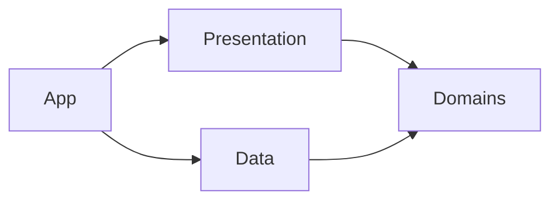

# System Overview

## 한글 요약

- `BucksCopy`는 SwiftUI 네이티브 macOS 앱으로 시작합니다.
- 초기 거래소는 Bitget, 상품 범위는 USDT-M Futures, 실행 모드는 Paper trading입니다.
- Bitget API product line은 v1에서 `productType=USDT-FUTURES` 단일값으로 고정합니다.
- Dashboard v1 심볼 catalog와 Watchlist는 BTCUSDT/ETHUSDT만 앱 상태에 보관하고 노출합니다.
- 레이어는 `App / Presentation / Domains / Data` 네 축으로 단순하게 둡니다.
- Bitget candle 조회 한계를 보완하기 위해 Watchlist 시장 데이터는 로컬 DB에 누적 저장합니다.
- Dashboard v1은 Connect-only API credential 입력, 연결 후 계정 요약, BTC/ETH Watchlist, interactive Bitget-backed SwiftUI Canvas candle chart, 백그라운드 백테스트, read-only 실계정 포지션, Paper bot 로그를 한 화면에 둡니다.
- 실거래 주문은 v1에서 기본 차단이며, future live policy가 명시되기 전까지 live execution을 구현하지 않습니다.

## 구조 원칙

1. UI, 도메인 규칙, 거래소 연동, 저장소, 실행 엔진을 분리합니다.
2. API credential은 Keychain-facing Data 코드만 소유합니다.
3. Bitget REST/WS 응답은 Data 경계에서 DTO로 받고 Domain 모델로 변환합니다.
4. Strategy는 주문 API를 직접 부르지 않고 paper/live execution gateway contract만 사용합니다.
5. Candle 생성은 deterministic하게 테스트 가능한 Domain/Data 경계로 둡니다.
6. Watchlist에 없는 심볼은 WebSocket 구독, strategy 실행, paper order intent 생성 대상이 아닙니다.
7. Strategy는 로컬에 저장된 closed candle과 새로 수신한 closed candle만 소비합니다.

## 레이어별 책임

| 레이어 | 넣는 것 | 넣지 않는 것 |
| --- | --- | --- |
| App | macOS entry, window/menu, composition root, environment 선택 | feature 내부 상태, Bitget DTO, strategy rule |
| Presentation | 로그인/API 인증 UI, Watchlist 선택 UI, bot status UI, strategy setting UI, reusable SwiftUI component | Keychain 직접 접근, URLSession/WebSocket 직접 접근, strategy rule |
| Domains | futures symbol, contract spec, watchlist, candle/order/portfolio/strategy/risk contract, use case, business rule | Bitget endpoint, SwiftUI, Keychain, URLSession, SQLite |
| Data | Bitget router, DTO, repository 구현, HTTP/WebSocket adapter, Keychain credential store, local market history store, clock/logging/error adapter | SwiftUI 화면, strategy policy, raw credential 로그 |

## 목표 의존 방향

## Bitget Integration Defaults

- REST base domain: `https://api.bitget.com`.
- WebSocket public domain: `wss://ws.bitget.com/v2/ws/public`.
- WebSocket private domain: `wss://ws.bitget.com/v2/ws/private`.
- v1 API family: Classic Futures v2 mix API.
- v1 product type: `USDT-FUTURES`.
- v1 margin coin: `USDT`.
- Private REST requests require signed headers.
- WebSocket connections must implement ping/pong and reconnect policy.
- WebSocket subscriptions are scoped to Watchlist symbols only.
- Keep one WebSocket connection at or below 50 subscribed channels by default.
- Candle channels and REST candle history are treated as exchange input; internal candle aggregation remains testable without network.
- Connect stores credentials in Keychain, validates private API access, and saved credentials auto-connect on the next launch.

## Bitget API / Socket Scope

| Scope | Endpoint / Channel | Purpose |
| --- | --- | --- |
| Public REST | `GET /api/v2/mix/market/contracts` | Load USDT-M Futures contract config and Watchlist candidates |
| Public REST | `GET /api/v2/mix/market/candles` | Backfill historical candles |
| Public REST | `GET /api/v2/mix/market/history-candles` | Backfill older finished candles when normal candle range is insufficient |
| Public WS | `ticker` | Latest price, bid/ask, funding/state display |
| Public WS | `trade` | Trade stream for higher-fidelity market input |
| Public WS | `candle1m` | Default live candle input for internal aggregation |
| Private REST | `GET /api/v2/mix/account/accounts` | Credential test and account snapshot |
| Private REST | `GET /api/v2/mix/position/all-position` | Position snapshot |
| Private REST | `POST /api/v2/mix/order/place-tpsl-order` | Exchange-side TP/SL protection order adapter; not auto-enabled while live entry is disabled |
| Private WS | `orders` | Order status tracking structure |
| Disabled | `POST /api/v2/mix/order/place-order` | Live order placement blocked until future policy |

## Dashboard UX Defaults

- Credential entry has one primary `Connect` action. It saves `APIKey`, `SecretKey`, and `Passphrase` through Keychain-facing Data code and immediately validates Bitget private REST access.
- When a saved credential exists at app launch, the dashboard attempts auto-connect before showing account-dependent data.
- After connection, the top-left credential form is replaced by a user/account summary showing equity, available balance, unrealized PnL, and read-only position count.
- The left column is scrollable because strategy, bot, and backtest controls can exceed the compact macOS window height.
- BTCUSDT/ETHUSDT are the only Dashboard v1 symbols, so the Watchlist panel does not include symbol search.
- The candle chart uses one price pane. Volume is not drawn as a separate chart until the UI explicitly labels and designs it.
- The chart includes a right-side price axis, latest-price line, zoom controls, reset, horizontal drag pan, and vertical drag pan.
- Chart zoom uses continuous candle spacing instead of a fixed visible-count jump. As spacing changes, candle width and visible candle count change together.
- The default viewport should focus on recent candles instead of scaling every locally stored candle into one compressed view.

## Watchlist Rules

- Load Dashboard v1 symbols with `GET /api/v2/mix/market/contracts?productType=USDT-FUTURES&symbol=BTCUSDT` and the same request for `ETHUSDT`.
- A symbol can be selected only when `symbolStatus=normal` and `supportMarginCoins` contains `USDT`.
- Dashboard v1 keeps only BTCUSDT and ETHUSDT from the tradable contract response.
- Watchlist symbols drive WebSocket subscription, strategy execution, and paper order intent generation.
- Watchlist overflow must either split WebSocket connections or fail validation before subscribe.
- The first implementation should prefer validation failure over silent partial subscription.

## Local Market History Strategy

- Store market history locally for Watchlist symbols because Bitget candle APIs cannot guarantee unlimited lookback from the current moment.
- v1 default storage is a SQLite-backed Data adapter. Do not store API key, secret, passphrase, or raw private account/order payloads in this DB.
- Persist normalized 1m closed exchange candles and derived closed candles for `15m`, `1H`, `4H`, `12H`, and `1D`.
- Use `(productType, symbol, granularity, openTime)` as the natural unique key so REST backfill and WebSocket updates are idempotent.
- Current implementation: on app start or selected symbol/timeframe change, load local candles, call `GET /api/v2/mix/market/candles` for the latest window, upsert the result, reload the chart, then start the matching public WebSocket candle subscription.
- Target gap-fill implementation: load the last local closed candle per Watchlist symbol, request only the missing gap from Bitget, upsert the result, then resume WebSocket streaming.
- If no local history exists, seed from the maximum officially queryable REST range, then continue accumulating locally from that point forward.
- Keep in-progress candles either in memory or stored with an explicit non-closed state; strategy execution must ignore non-closed candles.
- Public WebSocket candle pushes are stored with an explicit non-closed state until a later interval or REST refresh confirms closure.
- Paper execution may keep minimal local audit records for debugging and strategy review, but candle history is the primary long-lived dataset.

## Candle API Limits To Design Around

- `GET /api/v2/mix/market/candles` is limited to 20 requests per second per IP, returns 100 rows by default, and allows up to 1000 rows per request.
- Normal candle query history varies by granularity: `1m/3m/5m` up to one month, `15m` up to 52 days, `30m` up to 62 days, `1H` up to 83 days, `2H` up to 120 days, `4H` up to 240 days, and `6H` up to 360 days.
- `startTime`/`endTime` requests have a maximum query range of 90 days.
- `GET /api/v2/mix/market/history-candles` is also limited to 20 requests per second per IP and returns a maximum of 200 finished candles per request.

## Planned Domain Types

| Type | Role |
| --- | --- |
| `FuturesSymbol` | Bitget USDT-M Futures symbol identity |
| `ContractSpec` | precision, min trade, multiplier, margin support, symbol status |
| `APIKeyCredential` | APIKey, SecretKey, Passphrase bundle stored only through Keychain-facing Data adapter |
| `CredentialStatus` | disconnected/saved/validating/connected/failed UI state |
| `DashboardState` | combined Presentation state for credential, Watchlist, candles, positions, strategy, logs |
| `Watchlist` | user-selected tradable symbol set |
| `Candle` | OHLCV data for 15m/1H/4H/12H/1D |
| `MarketHistoryCursor` | last persisted closed candle per symbol/granularity |
| `PositionSnapshot` | read-only Bitget current position projection |
| `StrategyDefinition` | built-in strategy registry item |
| `StrategyConfig` | selected strategy and parameter values |
| `StrategyRunState` | stopped or running Paper state |
| `StrategySignal` | strategy output before order intent |
| `OrderIntent` | desired paper/live order action after strategy |
| `PaperOrder` | simulated execution record |
| `RiskDecision` | allow/block decision with reason |
| `TradeEventLog` | persistent bot/signal/paper/risk/position event log |

References:

- [Bitget API Domain](https://www.bitget.com/api-doc/common/domain)
- [Bitget REST API / Signature](https://www.bitget.com/api-doc/classic/quickStart/intro)
- [Bitget WebSocket API](https://www.bitget.com/api-doc/classic/quickStart/websocket-intro)
- [Bitget Futures Contract Config](https://www.bitget.com/api-doc/classic/contract/market/Get-All-Symbols-Contracts)
- [Bitget Futures Candlestick Channel](https://www.bitget.com/api-doc/classic/contract/websocket/public/Candlesticks-Channel)
- [Bitget Futures Candle Data](https://www.bitget.com/api-doc/classic/contract/market/Get-Candle-Data)
- [Bitget Futures Historical Candle Data](https://www.bitget.com/api-doc/contract/market/Get-History-Candle-Data)
- [Bitget Futures Place Order](https://www.bitget.com/api-doc/contract/trade/Place-Order)
- [Bitget Futures Stop-profit and Stop-loss Plan Orders](https://www.bitget.com/api-doc/contract/plan/Place-Tpsl-Order)
- [Bitget Futures Order Channel](https://www.bitget.com/api-doc/classic/contract/websocket/private/Order-Channel)

## Trading Defaults

- Supported planning timeframes: `15m`, `1H`, `4H`, `12H`, `1D`.
- Strategy logic consumes closed candle data unless a future feature explicitly models in-progress candles.
- Built-in strategies must emit `entryPrice`, `stopLoss`, and `takeProfit` together when they produce a signal.
- Built-in strategy inputs are limited to local closed OHLCV candles, so implemented indicators are computed internally from close/high/low/volume rather than requested from Bitget.
- Built-in strategy set: blocked-candle short.
- Automatic strategy leverage is capped at `10x` even if Bitget contract config allows more.
- Risk policy blocks invalid entry/stop/take layouts, signals below `2:1` reward/risk, signals whose stop-loss percent multiplied by leverage is `>= 30%`, and signals whose leveraged take-profit does not exceed estimated round-trip trading fees.
- Current trading fee estimates distinguish order intent:
  - Entry after a closed-candle signal is assumed to be market execution, so it uses taker fee.
  - Take-profit protection is modeled as exchange-side reduce-only limit execution, so the planning model uses maker fee.
  - Stop-loss protection is modeled as exchange-side trigger market execution, so it uses taker fee.
- Backtesting is manual-only from the UI. It loads local candles and runs the strategy engine on a detached background task, then publishes only the summary result to SwiftUI.
- Backtest results are shown in Korean-first metrics: win rate, trade count, net return, average reward/risk, max drawdown, and blocked signals.
- Paper execution records intent, simulated fill, rejected order, and risk decision separately.
- Live execution requires a future accepted decision log entry, security review, and explicit UI switch.

## Exchange-Side Protection Orders

- A live entry is not considered protected until both take-profit and stop-loss orders are accepted by Bitget.
- The intended live sequence is market entry -> fill confirmation -> exchange-side TP/SL registration -> TP/SL registration confirmation.
- TP is represented as a Bitget TPSL `profit_plan` with a limit `executePrice`; SL is represented as a `loss_plan` with market execution (`executePrice=0`).
- Protection registration failures must be retried at least 5 times per failed protection order before the position is treated as protection-failed.
- If retries are exhausted after a real entry fill, the future live runner must fail closed: emit a high-severity risk log and either market-close the position or enter an explicitly reviewed emergency state.
- The current code includes the domain retry installer and Bitget TPSL adapter, but automatic live entry remains disabled until the live execution policy is accepted.

## Strategy Portfolio Plan

- The long-term goal is not one universal strategy. The goal is to select roughly 4-5 high-quality strategies through local backtesting and run them as a portfolio.
- The selection unit is `strategy × timeframe`, not strategy alone. A strategy can be enabled for multiple timeframes, and a single timeframe can have multiple enabled strategies.
- Candidate combinations must be evaluated by win rate, net return after fees, trade count, drawdown, and blocked-signal frequency.
- When a closed candle arrives for a timeframe, every enabled strategy for that symbol and timeframe can be evaluated.
- More active combinations should increase trade opportunities, but execution must still cap risk by Watchlist symbol, leverage, open position state, duplicate signal handling, and opposite-signal handling.
- Portfolio backtesting should eventually report both per-combination metrics and aggregate portfolio metrics so weak combinations can be removed without disabling the whole strategy family.

## Strategy Research Notes

- The active built-in strategy is blocked-candle short only.
- Blocked-candle short requires three consecutive bullish candles with shrinking bodies, a third high below the second high, and a strong bearish reversal candle.
- Previous broad indicator strategies are not active until local backtest data shows a usable edge.
