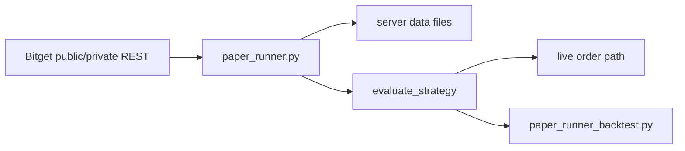

# System Overview

## 한글 요약

- `BucksCopy`의 현재 활성 제품은 Python 서버 runner입니다.
- 실거래 신호 판단의 단일 기준은 `Server/PaperRunnerPython/paper_runner.py`입니다.
- 백테스트/자산곡선 검증은 `paper_runner.evaluate_strategy(...)`를 직접 호출하는 `Server/PaperRunnerPython/paper_runner_backtest.py`를 사용합니다.
- 기존 Swift/macOS 앱과 Swift 백테스트 엔진은 활성 프로젝트에서 제거되었습니다.
- 거래 범위는 Bitget USDT-M Futures, `productType=USDT-FUTURES`, closed `15m` candle입니다.
- live order는 credential 연결, explicit live consent, fresh private snapshot, runner lock, order env switch, positive margin 조건을 모두 통과해야 합니다.

## Runtime Boundary

## Active Strategy Routes

| Symbol | Timeframe | Strategy |
| --- | --- | --- |
| BTCUSDT | 15m | BTC 15m Vacuum Pulse |
| BTCUSDT | 15m | BTC 15m Pulse 107 |
| ETHUSDT | 15m | ETH 15m Vacuum Pulse |

`paper_runner.py` owns the active strategy parameters and the live closed-candle evaluation loop. Backtest tools must not reimplement entry signal logic separately. Time-whitelist dependent BTC Regime/Bull candidates were deleted from the runtime registry after validation showed they depended on optimized weekly-hour filters.

## Data And Safety

- Market candles are shared server-wide as normalized candle files.
- User status, control, strategy selection, evaluations, and trade logs are user-scoped.
- Bitget API key, secret, passphrase, signatures, and raw private responses must not be logged or committed.
- If credential encryption is configured, Bitget credentials are stored only as AES-256-GCM encrypted user records.
- Live entry sequence is set leverage -> market entry -> fill confirmation -> position snapshot verification -> TP1/TP2/SL protection.
- Protection-order retry exhaustion triggers fail-closed close-position only when a fresh position snapshot still shows an open position.

## Validation Boundary

- Strategy validation uses fixed market-history fixtures and checks deterministic outputs for active runtime strategies.
- Live execution tests check payload shape, live gate blocking, protection-order registration, test entry/close behavior, and sanitized failure logs.
- Swift/macOS tests are no longer part of the active validation suite.
